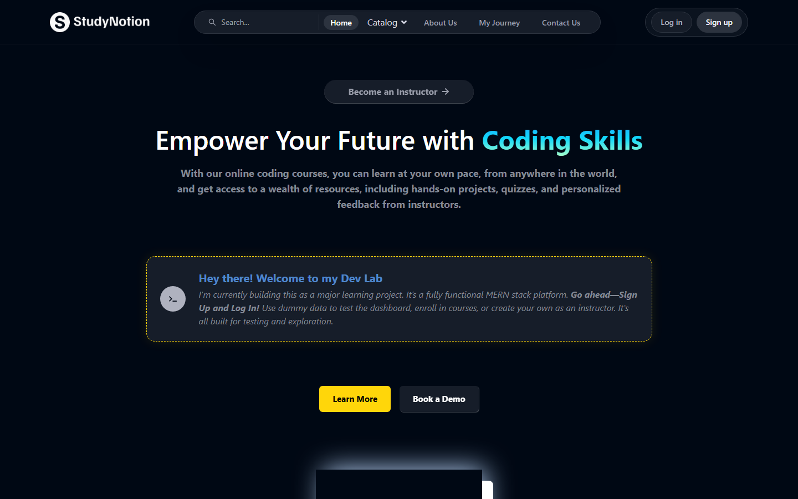

# StudyNotion FullStack Major Project

A production-style MERN learning platform where students discover courses, instructors publish content, and authenticated users manage their learning from role-based dashboards.


## 🖼️ Screenshots

### 🖥️ Desktop


### 📱 Mobile


> [!TIP]
> Screenshots are auto-captured from the live deployment.

## 📚 Table of Contents

- [Overview](#-overview)
- [Features](#-features)
- [Tech Stack](#-tech-stack)
- [Project Structure](#-project-structure)
- [Getting Started](#-getting-started)
- [Usage](#-usage)
- [API Reference](#-api-reference)
- [Configuration](#-configuration)
- [Contributing](#-contributing)
- [License](#-license)

## 🔎 Overview

StudyNotion is a full-stack e-learning platform inspired by modern course marketplaces. It combines a Vite-powered React frontend with an Express/MongoDB backend to support public course discovery, account creation, OTP verification, password reset flows, course creation, course content management, enrollment, progress tracking, ratings, reviews, and profile management.

The project exists as a major MERN learning build: it demonstrates how a real-world course platform can be split into a responsive single-page application, a REST API, persistent MongoDB models, role-based authorization, media uploads, transactional email templates, and dashboard workflows for different user types.

The app is built for:

- Students who want to browse, enroll in, and track courses.
- Instructors who want to create courses, organize sections/subsections, and view dashboard analytics.
- Admin-style workflows such as protected contact retrieval and category/course management.

Key architectural choices include:

- Client-side routing with protected and open route wrappers.
- Redux Toolkit slices for auth, profile, cart, course-building, and view-course state.
- Centralized Axios API connector using `VITE_BASE_URL`.
- Backend route separation by domain: auth, profile, course, and payment.
- JWT authentication with cookie/header token support.
- Role guards for `Student`, `Instructor`, and `Admin`.
- Cloudinary-backed media upload helpers.
- Email delivery through Brevo templates.

> [!NOTE]
> Dashboard routes exist in the app, but they are protected by authentication. The README screenshots show the public live home page.

## ✨ Features

### Public Experience

- ✅ Responsive landing page with StudyNotion branding and course-focused hero content.
- ✅ Public routes for Home, About, Contact, Catalog, Course Details, Login, Signup, My Journey, Forgot Password, and Reset Password.
- ✅ Catalog dropdown and category-driven course browsing flow.
- ✅ Contact form backed by an API endpoint.
- ✅ Reusable UI components such as Navbar, Footer, CTA buttons, tabs, spinners, rating stars, and confirmation modals.

### Authentication & Accounts

- ✅ Student and instructor signup flow.
- ✅ OTP generation and verification support.
- ✅ Login with JWT token handling.
- ✅ Password reset token and password update flow.
- ✅ Authenticated profile retrieval and update APIs.
- ✅ Profile picture upload support.
- ✅ Account deletion endpoint.

### Student Workflows

- ✅ Enrolled courses dashboard route.
- ✅ Wishlist/cart-style course flow.
- ✅ Course purchase history route.
- ✅ Full course view route for lecture playback.
- ✅ Course progress update endpoint.
- ✅ Rating and review creation.

### Instructor Workflows

- ✅ Instructor dashboard route.
- ✅ Course creation flow with multi-step course builder.
- ✅ Course editing and deletion.
- ✅ Section and subsection creation, update, and deletion.
- ✅ Course thumbnail and lecture media upload support.
- ✅ Instructor course listing and analytics endpoint.

### Backend & Integrations

- ✅ Express 5 REST API with modular route files.
- ✅ MongoDB/Mongoose data models for users, profiles, courses, sections, subsections, categories, tags, OTPs, payments, ratings, and progress.
- ✅ Cloudinary integration for uploaded images/videos.
- ✅ Brevo email integration for OTP, password reset, enrollment, contact, and password update emails.
- ✅ Razorpay configuration present for payment integration.
- ✅ CORS configured with credentials support.

## 🧰 Tech Stack

| Layer | Technology | Purpose |
|---|---|---|
| Frontend |  React 19 | Component-based SPA interface |
| Build Tool |  Vite 7 | Fast local dev server and production bundling |
| Styling |  Tailwind CSS 3 | Utility-first responsive styling |
| Routing | React Router DOM 7 | Public, protected, dashboard, and course-view routing |
| State | Redux Toolkit + React Redux | Auth, profile, cart, course, and lecture-view state |
| HTTP Client | Axios | Centralized API requests with credentials |
| Forms/UI | React Hook Form, React Hot Toast, React Icons, Framer Motion, Swiper | Form handling, feedback, icons, animation, and sliders |
| Charts | Chart.js + React Chart.js 2 | Instructor dashboard visualization |
| Media | React Dropzone, Video React | File uploads and lecture video playback |
| Backend |  Node.js + Express 5 | REST API and middleware layer |
| Database |  MongoDB + Mongoose | Persistent document storage and schema modeling |
| Auth | JWT, bcrypt, cookie-parser | Token auth, password hashing, and cookies |
| Uploads | Cloudinary + express-fileupload | Image/video upload handling |
| Email | Brevo API + Nodemailer templates | OTP, reset, enrollment, and contact emails |
| Payments | Razorpay | Payment gateway configuration |
| Deployment | Vercel frontend config | SPA rewrite support through `vercel.json` |

## 🗂️ Project Structure

```text
StudyNotion_FullStack-Major-Project/
├── assets/                              # README screenshot assets
│   ├── home-desktop.png                 # Desktop screenshot from live deployment
│   └── home-mobile.png                  # Mobile screenshot from live deployment
├── public/                              # Static assets served by Vite
│   ├── favicon.ico                      # Browser favicon
│   ├── Login_Page_Image.jpg             # Auth page public image
│   ├── SignUp_Page_Image.jpg            # Signup page public image
│   └── vite.svg                         # Vite default asset
├── Server/                              # Express/MongoDB backend
│   ├── config/                          # Database, Cloudinary, Razorpay configuration
│   ├── controllers/                     # Route handlers for auth, courses, profile, payments, etc.
│   ├── mail/templates/                  # HTML email templates
│   ├── middlewares/                     # JWT auth and role authorization middleware
│   ├── models/                          # Mongoose schemas
│   ├── routes/                          # Express routers grouped by domain
│   ├── utils/                           # Mail, upload, and formatting helpers
│   ├── index.js                         # Backend entrypoint and route mounting
│   ├── package-lock.json                # Backend dependency lockfile
│   └── package.json                     # Backend scripts and dependencies
├── src/                                 # React frontend source
│   ├── assets/                          # UI images, logos, SVGs, video, and page assets
│   ├── components/                      # Reusable and feature-specific React components
│   │   ├── common/                      # Shared Navbar, Footer, buttons, modals, ratings, etc.
│   │   └── core/                        # Feature modules for auth, home, catalog, dashboard, courses
│   ├── data/                            # Static navbar, footer, dashboard, country, and course data
│   ├── hooks/                           # Custom React hooks
│   ├── pages/                           # Route-level page components
│   ├── redux/                           # Redux store and feature slices
│   ├── services/                        # Axios connector, endpoint map, and API operation helpers
│   ├── utils/                           # Constants and formatting helpers
│   ├── App.jsx                          # Top-level route definitions
│   ├── index.css                        # Global styles and Tailwind imports
│   └── main.jsx                         # React app bootstrap
├── .env                                 # Frontend environment variables
├── .gitignore                           # Git ignore rules
├── .npmrc                               # npm configuration
├── eslint.config.js                     # Frontend ESLint config
├── index.html                           # Vite HTML entry
├── MAJOR MERN STUDYNOTION  FRONTEND.md  # Development notes for frontend build process
├── package-lock.json                    # Frontend dependency lockfile
├── package.json                         # Frontend scripts and dependencies
├── postcss.config.js                    # PostCSS config
├── tailwind.config.js                   # Tailwind theme and content configuration
├── vercel.json                          # SPA rewrite configuration for Vercel
└── vite.config.js                       # Vite React plugin config
```

## 🚀 Getting Started

### Prerequisites

| Tool | Recommended Version | Why |
|---|---:|---|
| Node.js | 20+ | Required by modern Vite and frontend tooling |
| npm | 10+ | Used by both frontend and backend lockfiles |
| MongoDB | Atlas or local MongoDB | Backend persistence |
| Git | Latest stable | Clone and contribution workflow |
| Cloudinary account | Required for uploads | Course thumbnails, videos, profile images |
| Brevo account | Required for email flows | OTP, password reset, and transactional emails |
| Razorpay account | Optional unless enabling real payments | Payment gateway credentials |

Check local versions:

```bash
node --version
npm --version
git --version
```

### Installation

Clone the repository:

```bash
git clone https://github.com/dev0302/StudyNotion_FullStack-Major-Project.git
cd StudyNotion_FullStack-Major-Project
```

Install frontend dependencies:

```bash
npm install
```

Install backend dependencies:

```bash
cd Server
npm install
cd ..
```

### Environment Variables

Create a root `.env` file for the Vite frontend:

```bash
VITE_BASE_URL=http://localhost:4000/api/v1
```

Create `Server/.env` for the Express backend:

```bash
PORT=4000
DATABASE_URL=mongodb+srv://<user>:<password>@<cluster>/<database>
JWT_SECRET=replace-with-a-strong-secret
CLIENT_URL=http://localhost:5173
CLOUD_NAME=your-cloudinary-cloud-name
API_KEY=your-cloudinary-api-key
API_SECRET=your-cloudinary-api-secret
FOLDER_NAME=studynotion
BREVO_API_KEY=your-brevo-api-key
SENDER_EMAIL=verified-sender@example.com
RAZORPAY_KEY=your-razorpay-key
RAZORPAY_SECRET=your-razorpay-secret
```

| Name | Required | Default | Description |
|---|---|---|---|
| `VITE_BASE_URL` | Yes | None | Frontend API base URL used by Axios and endpoint helpers. |
| `PORT` | Yes | None | Express server port. |
| `DATABASE_URL` | Yes | None | MongoDB connection string for Mongoose. |
| `JWT_SECRET` | Yes | None | Secret used to sign and verify JWT auth tokens. |
| `CLIENT_URL` | Recommended | Deployed Vercel URL in templates/controllers | Frontend URL used in email links. |
| `CLOUD_NAME` | Yes for uploads | None | Cloudinary cloud name. |
| `API_KEY` | Yes for uploads | None | Cloudinary API key. |
| `API_SECRET` | Yes for uploads | None | Cloudinary API secret. |
| `FOLDER_NAME` | Yes for uploads | None | Cloudinary folder where uploaded course/profile media is stored. |
| `BREVO_API_KEY` | Yes for email | None | Brevo API key for transactional email. |
| `SENDER_EMAIL` | Yes for email | None | Verified sender email used by mail utilities. |
| `RAZORPAY_KEY` | Optional/current config | None | Razorpay key ID. |
| `RAZORPAY_SECRET` | Optional/current config | None | Razorpay secret. |

> [!WARNING]
> Do not commit real API keys, database URLs, JWT secrets, or payment credentials. Keep production secrets in the deployment provider's environment settings.

### Running Locally

Start the backend API:

```bash
cd Server
npm run dev
```

Expected output:

```text
Database connected successfully.
Cloudinary connected successfully.
Server is running at port : 4000
```

In a second terminal, start the frontend:

```bash
npm run dev
```

Expected Vite output:

```text
VITE v7.x.x ready in ...
Local: http://localhost:5173/
```

Open `http://localhost:5173/` in your browser.

## 💻 Usage

### Frontend Commands

```bash
npm run dev
npm run build
npm run preview
npm run lint
```

### Backend Commands

```bash
cd Server
npm start
npm run dev
```

### Common Local Flow

1. Start MongoDB or confirm your Atlas connection is reachable.
2. Start the backend from `Server/`.
3. Start the frontend from the repository root.
4. Create a student or instructor account through `/signup`.
5. Verify OTP through the auth flow.
6. Use instructor routes to create courses or student routes to browse/enroll.

> [!NOTE]
> Several dashboard routes depend on authenticated Redux state and user role. Unauthenticated users are redirected to `/login`.

## 📡 API Reference

The backend mounts all API routes under `/api/v1`.

### Auth Routes

| Method | Endpoint | Auth | Description |
|---|---|---|---|
| `POST` | `/api/v1/auth/signUp` | Public | Create a student/instructor account. |
| `POST` | `/api/v1/auth/sendOTP` | Public | Generate and email an OTP. |
| `POST` | `/api/v1/auth/login` | Public | Authenticate user and issue token/cookie. |
| `POST` | `/api/v1/auth/changePassword` | User | Change the authenticated user's password. |
| `POST` | `/api/v1/auth/resetPasswordToken` | Public | Generate password reset token. |
| `POST` | `/api/v1/auth/resetPassword` | Public | Complete password reset. |
| `POST` | `/api/v1/auth/contactUs` | Public | Submit contact form details. |
| `GET` | `/api/v1/auth/getAllContacts` | Admin | Retrieve contact form submissions. |

### Profile Routes

| Method | Endpoint | Auth | Description |
|---|---|---|---|
| `PUT` | `/api/v1/profile/updateProfile` | User | Update profile fields. |
| `DELETE` | `/api/v1/profile/deleteAccount` | User | Delete the authenticated account. |
| `GET` | `/api/v1/profile/getMyProfile` | User | Fetch the authenticated user's profile. |
| `GET` | `/api/v1/profile/getEnrolledCourses` | User | Fetch courses enrolled by the current user. |
| `PUT` | `/api/v1/profile/updateDisplayPicture` | User | Upload/update display picture. |
| `GET` | `/api/v1/profile/instructorDashboard` | Instructor | Fetch instructor dashboard metrics. |

### Course Routes

| Method | Endpoint | Auth | Description |
|---|---|---|---|
| `POST` | `/api/v1/course/createCourse` | Instructor | Create a new course. |
| `GET` | `/api/v1/course/getAllCourses` | Public | List all courses. |
| `POST` | `/api/v1/course/getCourseDetails` | Public | Fetch public course details. |
| `PUT` | `/api/v1/course/editCourseDetails` | User | Edit course metadata. |
| `GET` | `/api/v1/course/getInstructorCourses` | User | Fetch courses owned by instructor. |
| `DELETE` | `/api/v1/course/deleteCourse` | User | Delete a course. |
| `POST` | `/api/v1/course/getFullCourseDetails` | User | Fetch full authenticated course details. |
| `POST` | `/api/v1/course/updateCourseProgress` | User | Mark course lecture progress. |
| `POST` | `/api/v1/course/createSection` | Instructor | Add a course section. |
| `PUT` | `/api/v1/course/updateSection` | Instructor | Update a section. |
| `DELETE` | `/api/v1/course/deleteSection` | Instructor | Delete a section. |
| `POST` | `/api/v1/course/createSubSection` | Instructor | Add a lecture/subsection. |
| `PUT` | `/api/v1/course/updateSubSection` | Instructor | Update a lecture/subsection. |
| `DELETE` | `/api/v1/course/deleteSubSection` | Instructor | Delete a lecture/subsection. |
| `POST` | `/api/v1/course/createCategory` | Instructor | Create a course category. |
| `GET` | `/api/v1/course/showAllCategories` | Public | List categories. |
| `POST` | `/api/v1/course/getCategoryPageDetails` | Public | Fetch category page data. |
| `POST` | `/api/v1/course/createRating` | User | Create a course rating/review. |
| `GET` | `/api/v1/course/getAverageRating` | Public | Fetch average course rating. |
| `GET` | `/api/v1/course/getAllRating` | Public | Fetch ratings/reviews. |
| `POST` | `/api/v1/course/createTag` | Instructor | Create a tag. |
| `GET` | `/api/v1/course/findAllTags` | Public | List all tags. |
| `POST` | `/api/v1/course/buyFakeCourse` | Public | Enroll via the current fake purchase flow. |

### Payment Routes

| Method | Endpoint | Auth | Description |
|---|---|---|---|
| `GET` | `/api/v1/payment/paymentHistory` | Student | Fetch student payment history. |

### Frontend Routes

| Route | Access | Description |
|---|---|---|
| `/` | Public | Home page. |
| `/about` | Public | About page. |
| `/contact` | Public | Contact page. |
| `/catalog/:catalogName` | Public | Category catalog page. |
| `/courses/:courseId` | Public | Course details page. |
| `/login` | Guest | Login page. |
| `/signup` | Guest | Signup page. |
| `/forgot-password` | Guest | Password reset request. |
| `/update-password/:id` | Public token flow | Password update page. |
| `/verify-email` | Public auth flow | OTP verification page. |
| `/my-journey` | Public | Project journey/story page. |
| `/dashboard/my-profile` | Authenticated | Profile dashboard. |
| `/dashboard/settings` | Authenticated | Account settings. |
| `/dashboard/enrolled-courses` | Student | Enrolled courses. |
| `/dashboard/wishlist` | Student | Wishlist/cart page. |
| `/dashboard/courses` | Student | Student courses route. |
| `/dashboard/purchase-history` | Student | Purchase history. |
| `/dashboard/instructor` | Instructor | Instructor analytics dashboard. |
| `/dashboard/my-courses` | Instructor | Instructor course list. |
| `/dashboard/add-course` | Instructor | Course builder. |
| `/dashboard/edit-course/:courseId` | Instructor | Edit course flow. |
| `/view-course/:courseId/section/:sectionId/sub-section/:subSectionId` | Student | Lecture viewer. |

## ⚙️ Configuration

### Frontend

| File | Purpose |
|---|---|
| `package.json` | Frontend scripts, React dependencies, UI libraries, and Vite tooling. |
| `vite.config.js` | Enables the React plugin for Vite. |
| `tailwind.config.js` | Defines custom StudyNotion color palette, fonts, shadows, breakpoints, and Tailwind content paths. |
| `postcss.config.js` | Loads Tailwind and Autoprefixer through PostCSS. |
| `eslint.config.js` | Configures ESLint for React Hooks and React Refresh. |
| `vercel.json` | Rewrites all frontend routes to `index.html` so SPA routes work on Vercel. |
| `src/services/api.jsx` | Central endpoint registry built from `VITE_BASE_URL`. |
| `src/services/apiconnector.jsx` | Axios instance with `withCredentials: true`. |
| `src/redux/store.jsx` | Redux Toolkit store registration. |

### Backend

| File | Purpose |
|---|---|
| `Server/index.js` | Express app setup, middleware, database/cloudinary initialization, and route mounting. |
| `Server/config/database.js` | MongoDB/Mongoose connection. |
| `Server/config/cloudinary.js` | Cloudinary SDK configuration. |
| `Server/config/razorpay.js` | Razorpay instance configuration. |
| `Server/middlewares/AuthZ.js` | JWT auth and role guards for student, instructor, and admin access. |
| `Server/routes/*.js` | API route declarations. |
| `Server/controllers/*.js` | Business logic for each domain. |
| `Server/models/*.js` | Mongoose schemas and relationships. |

## 🤝 Contributing

Contributions are welcome when they keep the platform maintainable and aligned with the existing architecture.

1. Fork the repository.
2. Create a feature branch:

```bash
git checkout -b feature/your-feature-name
```

3. Install dependencies:

```bash
npm install
cd Server
npm install
cd ..
```

4. Configure environment variables for frontend and backend.
5. Make focused changes.
6. Run checks before opening a pull request:

```bash
npm run lint
npm run build
```

7. Commit with a clear message and open a pull request.

Code style guidelines:

- Keep route-level pages inside `src/pages`.
- Keep shared visual components inside `src/components/common`.
- Keep feature-specific components grouped under `src/components/core`.
- Keep API URLs centralized in `src/services/api.jsx`.
- Keep backend routes thin and controller logic inside `Server/controllers`.
- Use role guards for any route that requires student, instructor, or admin access.
- Never commit secrets, generated build output, or local dependency folders.

## 📄 License

This repository does not currently include a `LICENSE` file. Unless a dedicated license is added later, treat this project as MIT by default.
